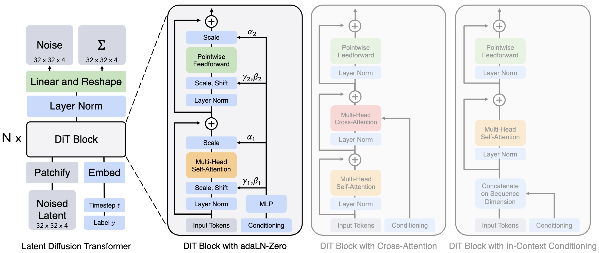

:PROPERTIES:
:ID:       D0C3C40E-AC68-425C-8849-B1CC3D70234F
:END:
#+title: Scalable Diffusion Models with Transformers
#+startup: latexpreview
#+filetags: :transformer:diffusion:

* Core Contribution

DiT (Diffusion Transformer) replaces the U-Net backbone commonly used in diffusion models with a standard Vision Transformer (ViT). The key insight: transformers follow predictable scaling laws, so larger DiT models consistently produce better samples with lower FID scores. This was already known for language models—DiT proves it holds for image generation.

The architecture operates in latent space (using a pre-trained VAE encoder), not pixel space. Input latents are patchified into tokens, processed through DiT blocks, and decoded back to images.

* Conditioning Mechanisms

#+CAPTION: Left: The input latent is decomposed into patches and processed by several DiT blocks. Right: Variants of DiT blocks that incorporate via adaptive layer norm, cross-attention, and extra input tokens.
#+NAME: Diffusion Transformer with different conditioning architectures.
#+DOWNLOADED: screenshot @ 2025-12-22 16:43:06

DiT explores four ways to inject conditioning information (class labels, timestep embeddings):

** In-context Conditioning

Append conditioning tokens (timestep + class embedding) as additional input tokens. Simple but increases sequence length.

** Cross-attention

Add cross-attention layer after self-attention in each block. Conditioning embeddings serve as keys/values, noisy latent tokens as queries. Standard approach from text-to-image models.

** [[id:AC0B3B8F-8CE5-4B17-B4A7-268D915D3DB6][Adaptive Layer Norm]] (adaLN)

Replace standard LayerNorm with adaptive version. The conditioning vector regresses scale ($\gamma$) and shift ($\beta$) parameters:

$$\text{adaLN}(h, c) = \gamma(c) \odot \text{LayerNorm}(h) + \beta(c)$$

where $c$ is the conditioning embedding (timestep + class).

** adaLN-Zero (Best performing)

Same as adaLN, but also regresses a per-dimension scaling parameter $\alpha$ applied after attention/MLP:

$$h = h + \alpha(c) \odot \text{Attention}(\text{adaLN}(h, c))$$

Crucially, $\alpha$ is initialized to zero, making each DiT block initially an identity function. This zero-initialization provides stable training from the start.

* Scaling Properties

DiT demonstrates clear Gflop-FID correlation: more compute → lower FID. The largest model (DiT-XL/2, 675M params) achieves state-of-the-art FID on ImageNet 256×256. Patch size matters significantly—smaller patches (DiT-XL/2 vs DiT-XL/4) improve quality at the cost of more compute.

* In Robotics

** Adaptation for Action Generation

In robotics, DiT has become the dominant architecture for diffusion-based policy learning (action diffusion). The core modification: instead of generating images, DiT generates action sequences conditioned on observations.

The DiT block takes input tokens (primarily vision and language tokens from a VLM backbone) and conditional inputs including:

- Denoising timestep embedding $t$
- Proprioceptive state embeddings (joint positions, gripper state)
- Sometimes: task embeddings or goal specifications

** Conditioning Architecture Choices

Robotics DiT variants typically combine multiple conditioning mechanisms:

*** adaLN-Zero for Timestep

The denoising timestep $t$ is almost universally injected via adaLN-Zero. This follows the original DiT finding that adaLN-Zero outperforms alternatives.

*** Cross-attention for Multi-modal Observations

Vision and language tokens from the VLM backbone are injected via cross-attention. This allows the action head to attend selectively to relevant visual regions and language tokens. See [[id:08FA117F-EBCC-406F-B3CC-59B9DDA64D6C][ManiFlow]] for DiT-X architecture using adaptive cross-attention.

*** In-context for Proprioception

Robot state (joint angles, end-effector pose) is often concatenated as additional input tokens, since proprioception is always relevant (unlike visual regions which may vary by task).
